# Python Essentials for STEM Wizards


# 1. Introduction (to the Job Market)
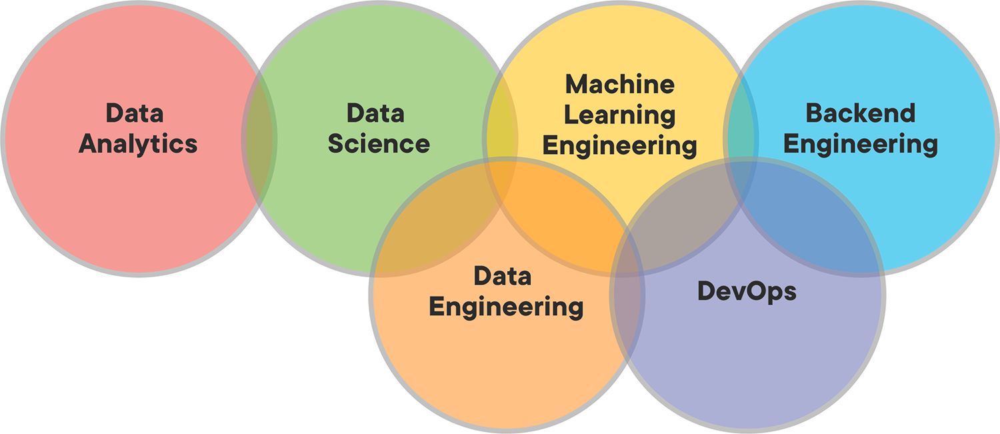

This repository is for STEM graduates who want to become software professionals. It's designed for those who excel in math, statistics, or data analysis but have knowledge gaps in software engineering. If you're great academically, but struggle with coding, this repo is perfect for you, no matter what data-based job you're aiming for.

## 1.1 Background

When I graduated in math and physics, I had only worked with [Python](https://www.python.org/) in a research setting, and my clunky code was holding me back. I needed to shift my thinking to a more computational approach. I realized that strong software skills could help solve complex problems. I found [Project Euler](projecteuler.net), a website focused on solving progressively challenging math problems with code, and thought it was the perfect place to start. Later, I found [LeetCode](https://leetcode.com/) was also crucial for improving.

## 1.2 Purpose
After six years as a professional developer, I've added the tools, tips, and tutorials I wish I'd had when I started. This repository walks through the basics of ***interfacing with the computer as a software developer*** while also solving [LeetCode](https://leetcode.com/) and [Project Euler](projecteuler.net) problems. If you're strong in math but need to improve your computer skills, this repository is for you.

# 2. Environment Setup 
If you've used [R](https://www.r-project.org/) or [Python](https://www.python.org/) in research, you may have used [Anaconda](https://www.anaconda.com/) to simplify setup, package installation, and writing prototype code. However, staying in this tutorial zone can limit you. Learning to set up Python and interact with your computer's filesystem is crucial foundational knowledge, even if it's frustrating at first.

## 2.1 Python
First, visit the [downloads section](https://www.python.org/downloads/) of the official Python website and download the latest version of the Python installer for Windows.

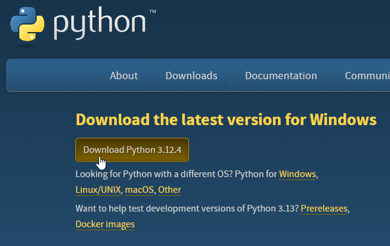

Unless you have a specific reason to use something older, use the latest version (e.g. TensorFlow is [incompatible with Python > 3.11](https://www.tensorflow.org/install) as of writing this). Does this mean if we want to use TensorFlow, we have to uninstall the latest version of Python? No. We can use different Python versions for different projects, but we'll tackle that a little later.

Go to wherever you downloaded the installer, then run it.
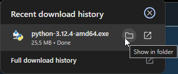
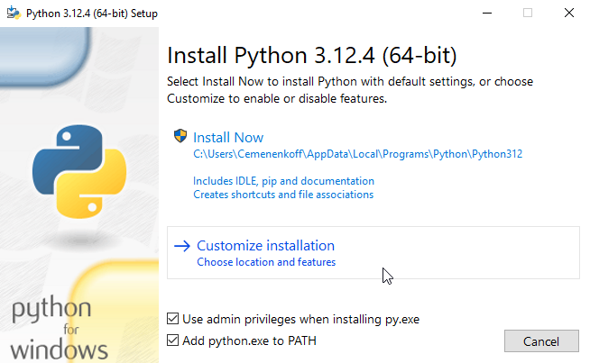
The **☑ Add python.exe to PATH** option during installation configures your Windows system to recognize Python commands from *any* command prompt.

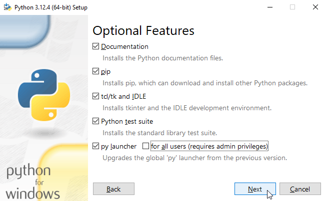
The only people who need to install Python globally work in IT. Even if you're on a company laptop, just install Python for yourself.

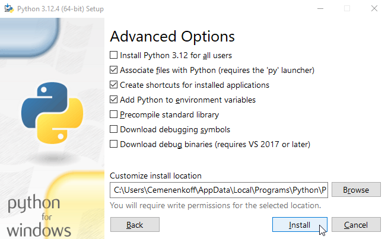
The **☑ Add Python to Environment Variables** option is equivalent to **☑ Add python.exe to PATH**. We want to set up the system's environment variables to include the directory where Python is installed.

Again, this allows the operating system to locate Python executables and scripts from *any* command line or terminal without needing to specify the full path (i.e. `C:\Users\Cemenenkoff\AppData\...\python.exe`). Instead, we can access Python by simply typing `python` in the shell.

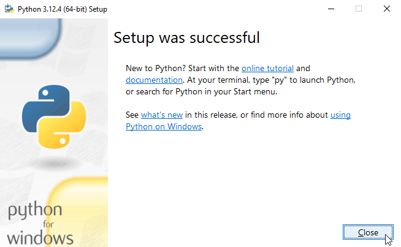
After installation, we can verify Python is correctly installed by opening Command Prompt and typing `python --version`, which should display the installed version of Python.

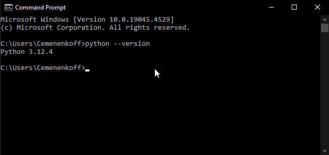

## 2.2 Git Bash  
Instead of [Command Prompt](https://learn.microsoft.com/en-us/windows-server/administration/windows-commands/windows-commands) or [PowerShell](https://learn.microsoft.com/en-us/windows-server/administration/windows-commands/powershell), I prefer using [Git Bash](https://git-scm.com/) because it is cross-platform and designed for Git, the near-ubiquitous version control system. Download the [latest stable build](https://git-scm.com/download/win) and install it with the default recommended settings.

## 2.3 Notepad++ 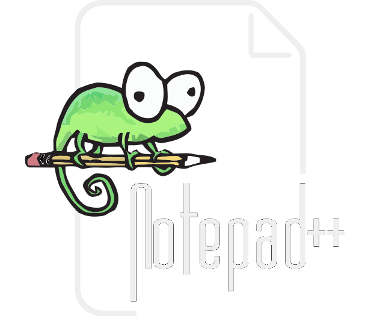
[Notepad++](https://notepad-plus-plus.org/) is a widespread, open source upgrade to Microsoft's default Notepad. If we were to code Python in a bare bones text editor, Notepad++ would be a logical choice. It has a clean GUI and a myriad of plug-ins and customizability, and it directly interfaces with Git Bash, our preferred terminal. Download the [latest stable build](https://notepad-plus-plus.org/downloads/) and install it with the default recommended settings.

## 2.4 VS Code 
[VS Code](https://code.visualstudio.com/) is the natural code editor for the modern developer using a Windows machine. Download the [latest stable build](https://code.visualstudio.com/). Old school coding veterans often prefer text editors like [VIM](https://www.vim.org/) or [Emacs](https://www.gnu.org/software/emacs/) that offer customization, efficiency, and speed at the expense of modern GUI and a gentler learning curve.

### 2.4.1 The Integrated Terminal
VS Code has a **built-in terminal** that allows us to run command-line operations without needing to switch windows. Be sure to set the default integrated terminal to `bash`.


<p align="center">
  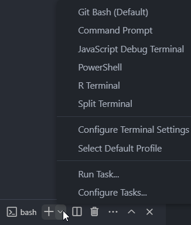
</p>

### 2.4.2 Hotkeys
Using hotkeys is the key to making coding feel comfortable and natural. It's essential to **automate your workflow**, and the less you have to move the mouse, the better your wrists will feel.

VS Code is fully accessible from the keyboard. The most important key combination to know is `Ctrl` + `Shift` + `P`, which brings up the Command Palette. From here, you have access to all functionality within VS Code, including keyboard shortcuts for the most common operations. Here are some of the most useful ones for beginners.

| Shortcut                 | Action                               |
|--------------------------|--------------------------------------|
| `Ctrl` + `Shift` + `P`   | Open Command Palette                 |
| `Ctrl` + `A`             | Select All                           |
| `Ctrl` + `C`             | Copy                                 |
| `Ctrl` + `V`             | Paste                                |
| `Ctrl` + `D`             | Add Selection to Next Find Match     |
| `Ctrl` + `O`             | File: Open File...                   |
| `Ctrl` + `K` `Ctrl` + `O`| File: Open Folder...                 |
| `Shift` + `Alt` + `R`    | File: Reveal in File Explorer        |
| `Ctrl` + `F`             | Find                                 |
| `Ctrl` + `H`             | Replace                              |
| `F5`                     | Debug: Start Debugging               |

### 2.4.3 The Debugger
In a professional context, the debugger is crucial for solving bugs. While print statements have their place, the debugger is *the most* important tool for identifying errors.

Like the built-in terminal, VS Code has a **built-in debug console**. When running a script with the debugger, you can explore variable states and the call stack when paused at a breakpoint.

By default, VS Code creates a *new* terminal for each debug run. This can consume unnecessary RAM, especially for new programmers who don't need previous debug outputs. To avoid this, configure VS Code to send output to the integrated debug console, clearing history after each run. This setting is managed in something called the `launch.json` file that appears in the dynamically-generated `.vscode` folder when prompted. [Here is the standard one I use](.vscode/launch.json).

```python
{
    // Use IntelliSense to learn about possible attributes.
    // Hover to view descriptions of existing attributes.
    // For more information, visit: https://go.microsoft.com/fwlink/?linkid=830387
    "version": "0.2.0",
    "configurations": [
        {
            "name": "Python Debugger: Current File",
            "type": "debugpy",
            "request": "launch",
            "program": "${file}",
            "console": "internalConsole",
            "internalConsoleOptions": "openOnSessionStart"
        }
    ]
}
```
### 2.4.4 Extensions for Quality of Life

After years of coding, I find these core extensions greatly enhance the VS Code experience:

1. **[One Dark Pro](https://github.com/Binaryify/OneDark-Pro) by binaryify**
   - This theme's syntax highlighting and clever use of italics ease frustration by making code more readable.

2. **[Material Icon Theme](https://marketplace.visualstudio.com/items?itemName=PKief.material-icon-theme) by Phillipp Kief**
   - Uses colored icons to simplify finding different file types in repositories with various supplemental files and directories.

3. **[Markdown All in One](https://marketplace.visualstudio.com/items?itemName=yzhang.markdown-all-in-one) by Yu Zhang**
   - Allows editing and previewing Markdown documentation directly in VS Code, streamlining the documentation workflow.

4. **[Markdown PDF](https://github.com/yzane/vscode-markdown-pdf) by yzane**
   - Converts Markdown documents into PDF format with ease.

5. **[Rainbow CSV](https://marketplace.visualstudio.com/items?itemName=mechatroner.rainbow-csv) by mechatroner**
   - Makes reading comma-separated values directly in VS Code possible, eliminating the need for Excel.

6. **[vscode-pdf](https://marketplace.visualstudio.com/items?itemName=tomoki1207.pdf) by tomoki1207**
   - Enables viewing PDF files directly in VS Code, reducing context switching.

7. **[Python Indent](https://marketplace.visualstudio.com/items?itemName=KevinRose.vsc-python-indent) by Kevin Rose**
   - Automatically indents Python code to the correct level, improving readability without distraction.

8. **[RUFF](https://astral.sh/ruff) by Astral Software**
   - Automatically formats Python code in modern Black-style, eliminating the need for manual formatting.
   - I would recommend adding these keyboard shortcuts for RUFF formatting.

   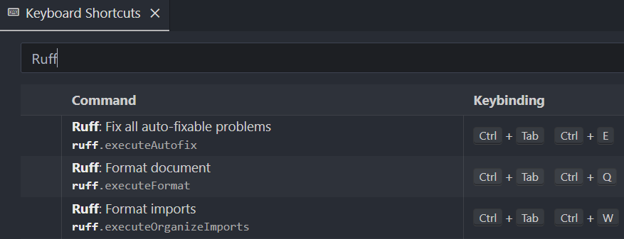

9. **[isort](https://github.com/microsoft/vscode-isort) by Microsoft**
   - Consistently sorts imports, enhancing code readability. Combined with RUFF, we can auto-format everything in our Python scripts except comments and docstrings.

10.  **[autoDocstring: VSCode Python Docstring Generator](https://marketplace.visualstudio.com/items?itemName=njpwerner.autodocstring) by Nils Werner**
    - Dynamically creates Google-style docstrings based on a function's definition, saving significant time, giving us that last piece of formatting automation.

### 2.4.5 Automated Style and Formatting
#### 2.4.5.1 The Black Formatter
[Black](https://github.com/psf/black) is an uncompromising Python code formatter that saves time and mental energy by automating code formatting, ensuring consistency, and reducing diffs for faster code reviews. It is a modern improvement to the previous standard, [PEP 8](https://peps.python.org/pep-0008/), and its the best modern way to format a code base. The RUFF extension utilizes Black when it performs its automated formatting.

### 2.4.6 Customizing User Settings
Black defaults to 88 characters per line while PEP8 uses between 72 and 99 characters. Keeping all of this in mind, I set up my user settings to highlight certain line lengths (i.e. rulers), wrap at 88 characters, set my file explorer to the right side, have my files save when changing cursor focus, use One Dark Pro, and other preferences. [Here is a link to the standard one I use](doc/settings.json).

Note that these settings are *user* settings, so they must be set by accessing **Preferences: Open User Settings (JSON)** from the command palette. Remember, `Ctrl` + `Shift` + `P` opens the command palette.


After the *user* `settings.json` file is open, you can copy-and-paste my settings file, but note that ***it assumes all previously-mentioned extensions are installed***.

## 2.3 Virtual Environments
Virtual environments are *essential* for managing project dependencies. They allow us to avoid the hassle of reinstalling Python multiple times when different projects require different versions (e.g., Python 3.8 vs. 3.12).

### 2.3.1 Global vs. Local Workspaces
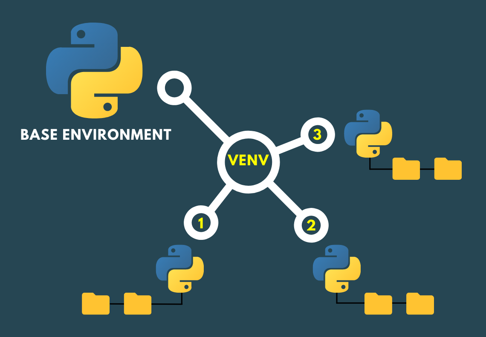
In a **global workspace**, Python packages are installed system-wide. While convenient for system tools and widely used libraries, this approach can lead to version conflicts and unintended updates across projects.

A **local workspace**, on the other hand, utilizes Virtual Environments to isolate project-specific dependencies. By creating a virtual environment for each project, we can install packages without affecting the system-wide Python installation. This isolation ensures that each project operates with its own set of dependencies, maintaining consistency and stability.

Local workspaces allow us to experiment with different package versions too, helping facilitate updating project **dependencies** (which can be a very frustrating process).
### 2.3.2 Creating a Virtual Environment
Once your workspace folder is open, do the following:
1. Run `pip install virtualenv`:
   1. What is `pip install`?
      1. In Python, `pip` stands for "Pip Installs Packages" and it's the default package installer for Python. We use it to install packages from the Python Package Index (PyPI). `install` is just one of the many commands available.
   2. What is `virtualenv`?
      1. It's a package for setting up virtual environments. While Python *does* already have a package that does this called `venv`, it is *only* compatible with Python >= 3.3, whereas `virtualenv` runs on a wider range of versions, plus offers additional features for more complex development environments.
2. Run `virtualenv venv`.
   1. This creates a virtual environment folder named `venv` in our workspace folder. It contains a sequestered installation of Python.
3. Run `source venv/Scripts/activate`.
   1. This command runs a .bat ("batch") file (batch files are automation scripts file for Windows) that sets up and activates the environment.
4. After the environment is activated, you should see `(venv)` above the first line of the terminal.
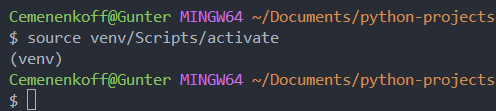

5. At this point, we have a blank slate to begin installing packages. If we are running someone else's project, they should have a `requirements.txt` file that lists out all modules necessary to get the software to work. To install these all in one go, run `pip install -r requirements.txt`.

### 2.3.2 Managing Dependencies
What if we want to make our own `requirements.txt` file? As our projects grow more complex, we'll need to import various Python libraries, each potentially requiring specific versions of *their* own dependencies. Without a proper system to manage these interconnected dependencies, things can quickly become a disorganized mess. A standard way to export currently-installed modules is with `pip freeze > requirements.txt`, but there is a better way.

#### 2.3.3 `pip-tools` and `requirements.txt`
By default, running `pip freeze > requirements.txt` exports a list of our project dependencies in a file named `requirements.txt`.

```
build==1.2.1
click==8.1.7
colorama==0.4.6
contourpy==1.2.1
```

This list, however, doesn't provide insight into what depends on what.

This is where `pip-tools` comes in. After installing with `pip install pip-tools`, once we need to export dependencies, our flow becomes:
1. `pip freeze > requirements.in`
2. `pip-compile`

What results is a newly-generated `requirements.txt` file that not only lists the required modules and versions, but all their interlaced dependencies as well. Especially when sharing code with other devs, having this information available provides valuable time-saving insights.

```
# This file is autogenerated by pip-compile with Python 3.12
# by the following command:
#
#    pip-compile
#
build==1.2.1
    # via
    #   -r requirements.in
    #   pip-tools
cfgv==3.4.0
    # via
    #   -r requirements.in
    #   pre-commit
click==8.1.7
    # via
    #   -r requirements.in
    #   pip-tools
colorama==0.4.6
    # via
    #   -r requirements.in
    #   build
    #   click
contourpy==1.2.1
    # via
    #   -r requirements.in
    #   matplotlib
```

# 3 Git and Version Control
Not using Git is a recipe for disaster. Developing enterprise software is complex, and tracking progress is essential. While there are various methods for version control (e.g., `myscript.py`,` myscript1.py`, `myscript1_final.py`), Git is by far the best. Although new developers may find Git intimidating at first, embracing it early on saves considerable pain and frustration in the long run.

## 3.1 Basic Git Overview
Watch [this video by ByteByteGo](https://www.youtube.com/watch?v=e9lnsKot_SQ) for a great overview of Git.

The four main areas Git interfaces with are:
1. /localWorkingDir
2. Staging Area
3. Local Repository
4. Remote Repository

The commands you'll use 99% of the time are:
- `git clone`
  - Creates a copy of an existing repository from a remote server to your local machine.
- `git branch`
  - Lists, creates, or deletes branches within a repository.
- `git checkout`
  - Switches between branches or restores files in the working directory.
- `git add`
  - Stages changes (new, modified, or deleted files) to be included in the next commit.
- `git commit`
  - Records the staged changes to the repository with a descriptive message.
- `git push`
  - Uploads local commits to a remote repository.
- `git pull`
  - Fetches and integrates changes from a remote repository into the current branch.

Rarely, you'll need additional commands when managing a complex code base. [This video by ByteByteGo](https://www.youtube.com/watch?v=0chZFIZLR_0) is a great introduction to them.
- `git merge`
  - Combines changes from one branch into another, creating a merge commit that integrates the histories of both branches.
- `git rebase`
  - Moves or re-applies a series of commits to a new base commit, creating a linear project history.
- `squash commit`
  - Combines multiple commits into a single commit, simplifying the commit history and making it cleaner. This can be done during a rebase or merge.

## 3.2 General Strategy to Git Development
After cloning a project and aunthenticating, we want to have a cohesive general approach to developing new features in our repo.
1. ***Commit frequently.*** We want to maintain a clean commit history by committing frequently, logically separating changing with meaningful commit messages. This makes reading the commit history much easier in the future.
2. ***Avoid partial pushes.*** Only push to remote when our work is ready, and avoid partial pushes. This is an essential practice to prevent bugs in production.
3. ***Develop on new branches.*** To make sure things don't get mixed up, its best to develop new features or bugfixes on new branches. Working solely on `master` is only really appropriate when you're the sole author of a project, and even still, creating new branches for particularly large feature changes saves a lot of headache if anything ever needs to be rolled back.

## 3.3 Usual Git Workflow
Here's how my standard development process looks on a daily basis. Again, `merge` or `rebase` aren't used often, so they aren't a part of this flow.
1. Clone the repository from its remote location to our local machine.
   1. `git clone <url>`
      1. This can be done with SSH or HTTPS. SSH saves time in the long run and could be considered slightly more secure, but both methods are just fine.
2. Make a new branch and switch to it.
   1. `git branch <name>` to create the branch.
   2. `git checkout <name>` to switch to it.
   3. *Or*, use `git checkout -b <name>` to do it all at once (this is the easiest way).
3. Make changes locally by creating new files or editing existing ones.
4. Add the changes to the Staging Area.
   1. `git add .`
      1. Note that `.` means *all* files, but we could specify individual ones with `git add "myfile.txt"` if we wanted to.
5. Commit the changes with a meaningful message:
   1. `git commit -m "msg1"`
6. Repeat steps 3-5 for subsequent changes, paced at logical intervals.
7. Push all commits to the remote repository.
   1. `git push`

# 4 Organizing Your Workspace
Adopting virtual environments, Git, and a well-structured folder tree streamlines our dev workflow and reduces errors. These practices are foundational for maintaining a clean, manageable, and scalable codebase, so its essential to practice them, even on personal projects.

## 4.1 Organizing the File Explorer
Most Python projects have similarly-named directories to organize files in a way that's familiar to developers. The names of the directories we're most likely to encounter are:
- `doc` (documentation)
- `img` (images)
- `src` (source code)
- `venv` (virtual environment)
- `tests` (unit tests)
- `bin` (executables)
- `lib` (additional non-pip-installable dependencies)
- `config` (configuration files)
- `notebooks` (interactive documentation)
- `examples` (examples of how to use the project)
- `queries` (SQL queries for fetching data)
- `static` (CSS, JavaScript, and images for web apps)
- `templates` (HTML templates for web apps)
- `logs` (logs generated by the app)
- `scripts` (various utility or setup scripts)
- `dist` (Stores distribution packages for the project (i.e. wheels))
- `build` (build-related files and temporary build artifacts)

Even if the names aren't familiar yet, using these folders when creating a workspace structure helps other developers use your project.

## 4.2 Code vs. Non-Code Files
In Python, I generally use the following file naming conventions when possible.
1. directories are lowercase `snake_case`
2. non-code files are lowercase `kebab-case`
3. classes are `PascalCase`
4. functions are lowercase `snake_case`

A file or directory that uses `kebab-case` can't be directly imported, so I especially like using `kebab-case` for non-code files to reinforce this idea.

## 4.3 Supplemental Files
According to me, every single repository worth its salt *needs* to have the following files.
- `.gitignore`
  - Specifies files and directories that Git should ignore. It ensures that sensitive or unnecessary files (e.g. log files or compiled binaries) are not tracked by version control.
- `README.md`
  - A Markdown file that serves as the entry point and documentation for a project. It typically includes a description of the project, installation instructions, usage examples, and other relevant information.
- `requirements.in`
  - A text file used with the `pip-compile` tool. It lists the direct dependencies of a project without specifying their versions explicitly. It's used to generate the `requirements.txt` file.
- `requirements.txt`
  - A text file that lists the Python packages (including their specific versions) required for a project. It allows for easy installation of dependencies using `pip install -r requirements.txt`.

As we want to automate our workflow further, we can introduce some of these additional ones (and there are many others too).
- `.flake8`
  - Configuration file for Flake8, a tool that checks Python code against style guides (like PEP 8) and detects various programming errors.
- `.gitattributes`
  - Configuration file that specifies attributes for files in a Git repository. It can define attributes such as text/binary handling, merge strategies, and end-of-line normalization.
- `.pre-commit-config.yaml`
  - Configuration file for the [Pre-commit framework](https://pre-commit.com/), which manages and executes hooks for code formatting, linting, and more, ensuring code quality before commits. If there are a ton of recommended changes to make, using the `--no-verify` flag bypasses the `pre-commit` checks.
- `pyproject.toml`
  - TOML configuration file that specifies build system requirements, dependencies, and other project metadata. I primarily use it to define settings for the Black code formatter.

# 5. Conclusion
If you've made it this far, bravo. It's a lot of condensed information, but it's the core of developing like a software engineer. Practicing these principles and workflows alongside coding concepts and data projects is the difference between pushing a project to production or having it sit in a closet as a prototype. [Docker containers](https://www.docker.com/resources/what-container/) are relevant to this idea, but are outside of the scope of this practice repo.

## 5.1 Where to Go from Here?
If you were able to use these concepts to clone or fork this repository to start developing solutions to Project Euler or LeetCode problems, treat this repo as a gym. It's a place to show up every day and keep your mind and software skills sharp. Don't just solve problems, but practice your workflows, and keep on top of your Github profile. Remember that consistency is key, and strength builds over time. You can't become a wizard in a day.

<p align="center">
  
</p>
